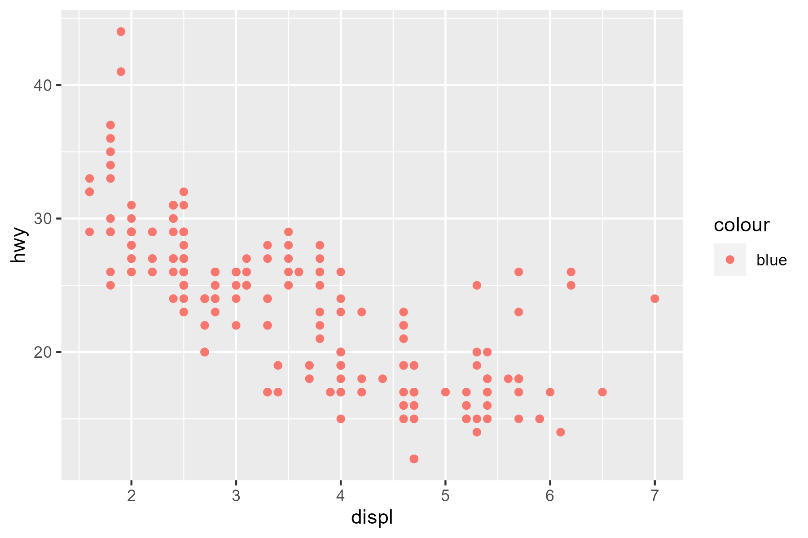

# Plotting-Multiple-Variables-using-qplot-and-ggplot
Plotting multiple variables on a single graph, Creating facets on the basis of two variables
#Exploration of MPG Dataset
#Quieck  and simple visualization using qplot

#By  Promise  Onyemaechi



```
library("tidyverse") #always run this line at starting R
mpg
#This dataset provides fuel economy data from 1999 and 2008 for 38 popular models of cars. The dataset is shipped

#Data Description
str(mpg) #structure

#Number of rows or observations or records
nrow(mpg)

#Number of columns or variables
ncol(mpg)

#PLOTTING TWO VARAIBLES 

#Displacement vs highway efficiency
Disp_eff= ggplot(data = mpg) + 
  geom_point(mapping = aes(x = displ, y = hwy), color='red')
#save file
ggsave("scatter_plot.png", plot = Disp_eff, width = 6, height = 4)

#The same graph can be built using qplot too

Disp_eff2=qplot(displ, hwy, data=mpg, geom="point", color='blue')
#save the file
ggsave("Displacement vs highway efficiency.png",plot=Disp_eff2,width = 6, height = 4 )

#Looking at this data separately for each type of transmission

Disp_eff2=qplot(displ, hwy, data=mpg, geom="point", color=trans)
ggsave("Saparate_graph.png", plot= sep_graph, width = 6, height = 4)

#Saparate graph for each vehicle
sep_graph= ggplot(data = mpg) + 
  geom_point(mapping = aes(x = displ, y = hwy, color=class)) +
  facet_wrap(~ class, nrow = 2)
ggsave("Saparate_graph.png", plot= sep_graph, width = 6, height = 4)

#Creating facets on the basis of two variables : number of cylinders and type of drive

f= ggplot(data = mpg) + 
  geom_point(mapping = aes(x = displ, y = hwy, color=drv)) +
  facet_grid(drv ~ cyl)
ggsave("facet_drv_cyl.png", plot= f, width = 6, height = 4)

'''
The facet_grid(drv ~ cyl) part of the code is used to create a grid of small multiple plots, where each subset of the data with unique combinations of drv and cyl values will be displayed in its own subplot within the grid. Let's break down what each aspect of this function call means:
  
  facet_grid: This function is used to create a grid of plots based on the specified variables. It allows you to arrange subsets of your data in a grid, creating multiple plots that share the same structure.

(drv ~ cyl): This part defines how the grid of plots should be organized. The formula drv ~ cyl indicates that you want to create subplots based on the combinations of drv (drive type) and cyl (number of cylinders) values. This will result in a grid where each row corresponds to a unique drv value, and each column corresponds to a unique cyl value.
```